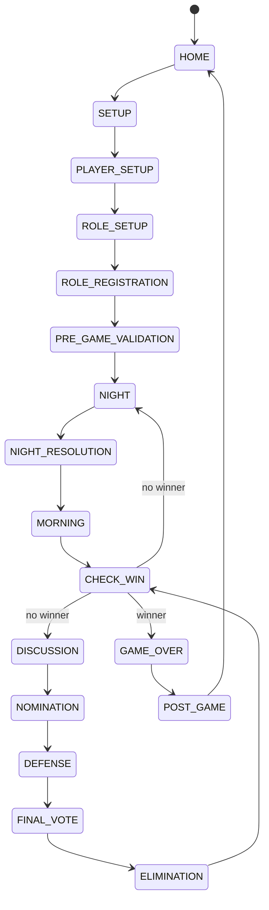

# Automated Werewolf Game Master — Product & System Requirements

**Document version:** 1.3  
**Status:** Baseline requirements / source of truth  
**Last updated:** 2026-08-19  
**Primary product:** Single-device, offline-first PWA  
**Primary language of implementation:** TypeScript  
**Primary game mode:** In-person Werewolf using physical role cards  
**Target form factor:** One smartphone placed at the center of the table  

---

## 0. How to use this document as AI/codegen context

This file is the canonical baseline for the Automated Werewolf Game Master project.

When generating product decisions, architecture, code, tests, or UI from this context:

1. Preserve the core product model: **physical cards determine roles; the phone replaces the human game master**.
2. The MVP is a **single-device PWA**. Do not require every player to install or use a personal device.
3. The game must remain playable **without Internet after the app and required assets have been loaded**.
4. The **domain/game engine must be framework-independent TypeScript**. React/Next.js renders and drives the engine but must not contain game rules.
5. Roles must be **data-driven and extensible**. Do not hard-code a fixed sequence such as `wolf -> guard -> seer -> witch`.
6. Night actions should normally be collected as **effects/intents first**, then resolved by the rules engine at the appropriate resolution point.
7. Never expose hidden role mappings, private investigations, night targets, or unresolved night results on public/interstitial screens.
8. House rules vary. Any rule with common variants should be **configuration**, not an implicit hard-coded assumption.
9. When a role rule is not defined in this document, do not invent behavior silently. Add an explicit rule decision/configuration before implementation.
10. Product UX should prioritize: **privacy, low friction, theatrical narration, reliable timers, large touch targets, and recovery from accidental refresh/lock**.

---

# 1. Product Overview

## 1.1 Problem

Traditional in-person Werewolf requires one participant to act as a game master/moderator. That person cannot fully participate as a player and must:

- remember the role wake-up order;
- narrate the night/day flow;
- track night actions;
- resolve interactions;
- manage discussion and voting timers;
- remember living/dead players;
- announce outcomes;
- determine win conditions.

The project replaces that moderator with a single smartphone while preserving the social, physical experience of playing with real cards.

## 1.2 Product concept

> **The cards assign roles. The phone runs the game.**

Players sit around a table and draw physical role cards as usual. One smartphone is placed in the middle of the table.

The phone:

- guides setup;
- privately records player-role mappings when needed;
- narrates each phase;
- calls roles at night in the configured order;
- presents the correct action UI for the active role;
- runs timers and sound effects;
- records role actions;
- resolves night effects and chain reactions;
- announces morning results;
- manages discussion, nomination, defense, and voting;
- eliminates players;
- checks win conditions;
- persists the match locally for recovery.

The phone does **not** replace physical cards in the primary product mode.

---

# 2. Goals and Non-Goals

## 2.1 Product goals

### G-01 — No dedicated human game master
All participants can remain players.

### G-02 — Preserve physical-card gameplay
Role distribution continues to happen through physical cards.

### G-03 — One shared phone
The core game must work with only one smartphone.

### G-04 — Dramatic and clear narration
Audio, countdowns, clock/ticking sounds, transitions, and visual cues should make the automated moderator feel intentional rather than mechanical.

### G-05 — Support varied role sets
The engine must support adding many roles and house rules without rewriting the main game loop.

### G-06 — Protect hidden information
Private role/action information must only be visible during the correct private interaction window.

### G-07 — Offline-first reliability
A game in progress must not depend on a server or stable Internet connection.

### G-08 — Recover from interruption
Refresh, browser crash, screen lock, or accidental app closure should not automatically destroy an active match.

### G-09 — Fast table setup
Starting a match should be practical for casual play and not feel like configuring enterprise software.

## 2.2 Non-goals for MVP

The following are explicitly outside the initial MVP:

- fully online Werewolf;
- one phone per player;
- matchmaking;
- user accounts;
- cloud synchronization;
- cross-device real-time synchronization;
- remote spectator mode;
- social/community role marketplace;
- native iOS/Android-only implementation;
- monetization/subscriptions;
- AI-generated narration during a match;
- computer vision recognition of physical cards;
- NFC/QR role cards as a requirement;
- anti-cheat guarantees against a malicious player who intentionally accesses local device data.

These can be considered later without changing the core domain model.

---

# 3. Target Users and Environment

## 3.1 Primary user group

A group of friends playing Werewolf in person around the same table.

Expected group size for MVP:

- recommended: 6–15 players;
- engine target: configurable beyond 15 where UI remains usable.

## 3.2 Device environment

Primary:

- modern iPhone Safari/PWA;
- modern Android Chrome/PWA.

Secondary:

- tablet;
- desktop browser for testing.

## 3.3 Physical environment assumptions

- phone is placed roughly in the center of the table;
- all players can hear the phone or a connected speaker;
- all players are expected to close their eyes during night phases;
- the currently called role may open their eyes and interact with the phone;
- large touch targets are required because the device may not be directly in front of the acting player;
- app should offer audio volume checks before starting.

---

# 4. Core Product Principles

## P-01 — Single shared device first

Do not introduce personal-device dependencies into the core flow.

## P-02 — Physical cards remain authoritative for the human experience

The app may record role mappings, but the physical card remains the player's tangible role token.

## P-03 — Server is not required to complete a match

The local game engine is authoritative in MVP.

## P-04 — Rules belong to the domain engine

UI must never be the source of truth for:

- who is alive;
- what actions are valid;
- role ordering;
- action eligibility;
- night resolution;
- death chains;
- winner detection.

## P-05 — Hidden information is transient in the UI

Secret information should be shown only while necessary, then immediately replaced with a privacy/interstitial screen.

## P-06 — Rule variants are explicit configuration

Examples:

- whether Guard may protect the same player on consecutive nights;
- Witch self-save policy;
- whether Witch sees the wolf victim;
- tie behavior;
- defense behavior;
- whether dead players reveal roles;
- whether a Hunter shoots when killed by specific causes.

## P-07 — Game state must be replayable/debuggable

Important decisions should be represented as domain events/effects rather than only transient UI mutations.

---

# 5. High-Level Game Lifecycle



A configuration may bypass `NOMINATION` or `DEFENSE` when the selected voting mode does not require them.

---

# 6. Setup Requirements

## 6.1 Match creation

The user can create a new local match.

Required setup data:

- player list;
- role composition/deck;
- rule preset or custom rules;
- timer settings;
- narration/audio settings;
- voting mode;
- role reveal policy;
- optional hidden-composition behavior.

## 6.2 Player setup

### FR-PLAYER-01
User can add a player by display name.

### FR-PLAYER-02
Player names must be unique within a match after normalization.

### FR-PLAYER-03
User can reorder players to match table seating order.

Seat order is important for roles/rules that depend on adjacent players.

### FR-PLAYER-04
User can edit/remove players before the game starts.

### FR-PLAYER-05
After the first night starts, player identity changes are locked except through an explicit recovery/admin flow.

## 6.3 Role/deck setup

The app must allow selecting the physical cards included in the current match.

Example composition:

- Werewolf ×2
- Villager ×2
- Seer ×1
- Guard ×1
- Witch ×1
- Hunter ×1

### FR-DECK-01
Role count must equal player count before the game can start.

### FR-DECK-02
The app must detect impossible/invalid role configurations defined by role constraints.

### FR-DECK-03
User can save reusable deck presets locally.

### FR-DECK-04
Role metadata must include whether it acts:
- at setup only;
- every night;
- conditionally at night;
- on death;
- during day;
- at game end.

### FR-DECK-05
Role metadata must not require the main game loop to know each role by name.

---

# 7. Secret Role Registration

Because roles such as Seer require the system to know another player's alignment/role, the system should support a private registration step after players physically draw their cards.

## 7.1 Registration flow

For each player in seating order:

1. Show neutral handoff screen.
2. Display the player's name.
3. Require an intentional action such as **Hold to reveal role choices**.
4. Player selects the role matching their physical card.
5. Player confirms.
6. The app stores the mapping.
7. Immediately show an opaque privacy screen.
8. Require an explicit **Pass to next player** action.
9. Do not provide Back navigation that reveals the previous selection.

The physical deck builder groups roles by alignment into Villagers,
Werewolves, and Third Party sections. During private registration, the choice
screen lists only roles whose configured physical-deck count is greater than
zero. This prepared-role list is derived from the persisted match composition
so it remains correct after recovery.

## 7.2 Role multiset validation

### FR-ROLE-REG-01
At the end of registration, submitted role counts must match the configured physical deck.

### FR-ROLE-REG-02
If they do not match, the system must not reveal the mismatching role or player.

Good message:

> Role registration does not match the selected deck. Please re-register roles.

Bad message:

> Three players selected Werewolf but the deck only has two.

### FR-ROLE-REG-03
Re-registration must restart the private registration flow without exposing previous mappings.

## 7.3 Trust model

The app prevents accidental disclosure, not determined cheating.

A player with deliberate physical access to the device/browser storage may potentially inspect information. Strong anti-tampering is not an MVP requirement.

---

# 8. Pre-Game Validation

Before Night 1, the app must validate:

- player count = role count;
- all players have a registered role;
- role multiset matches the selected deck;
- all required role rule variants have values;
- audio assets required by enabled roles are available offline;
- selected voting rules are complete;
- match persistence has been initialized.

The app should provide a short **audio test** and recommend:
- disabling notification sounds or enabling Do Not Disturb;
- connecting a speaker if needed;
- keeping the device powered/charged;
- allowing screen wake lock where supported.

---

# 9. Night Phase

## 9.1 Night goals

Night must:

- tell all players when to close/open eyes;
- activate roles in deterministic configured order;
- prevent accidental secret leakage;
- collect valid actions;
- handle timeouts;
- support conditional and one-time roles;
- resolve effects after collection according to rules.

## 9.2 Night sequence generation

The engine builds a `NightTurnQueue` from enabled roles and current game state.

A role is included when:

- it exists in the match and is eligible to act; or
- the configured Hidden Role/Decoy mode intentionally includes it as a dummy turn.

Queue ordering uses role metadata such as:

```ts
type NightRoleDefinition = {
  roleId: string;
  nightOrder: number;
  activation: 'FIRST_NIGHT' | 'EVERY_NIGHT' | 'CONDITIONAL';
};
```

The game loop must never contain fixed code equivalent to:

```ts
await wolfTurn();
await guardTurn();
await seerTurn();
await witchTurn();
```

## 9.3 Inter-role privacy transition

Every private role turn must be surrounded by an interstitial.

Required pattern:

1. neutral/dark screen;
2. narrator calls role;
3. short wake delay;
4. role action UI appears;
5. action confirms or times out;
6. immediately hide action result;
7. narrator asks role to sleep;
8. privacy delay;
9. move to next role.

No next-role private UI may be visible while the previous role may still be looking.

The privacy delay is a match-level timer setting (5 seconds by default). It
starts automatically before the first role call, after every completed role
turn, and before dawn after the final role. Expiry advances the night without a
moderator tap; a manual retry is shown only if the persisted transition fails.

## 9.4 Role action timers

Each action can define:

- total duration;
- warning threshold;
- countdown display;
- ticking sound enabled/disabled;
- auto-skip or default action on timeout;
- optional manual skip.

Timer behavior must use monotonic/deadline-based logic rather than decrement-only UI loops so temporary browser throttling does not permanently desynchronize time.

## 9.5 Night timeout behavior

A timed-out action must have an explicit role-specific policy:

- `NO_ACTION`;
- `KEEP_PREVIOUS`;
- `RANDOM_VALID_TARGET` only if a rule explicitly enables it;
- `DEFAULT_TARGET` only when rule-defined.

The system must never silently choose a random target unless configured.

## 9.6 Werewolf action

Baseline behavior:

- eligible living Werewolves wake together;
- UI displays valid living targets;
- wolf-side invalid targets are disabled according to rules;
- wolves choose one victim;
- selection is confirmed;
- engine records an `ATTACK` intent/effect;
- player is not immediately marked dead.

If future variants require wolf voting rather than a single shared choice, it must be a configurable Werewolf action strategy.

## 9.7 Guard action

Baseline:

- Guard selects one valid living target;
- consecutive-night self/target restrictions are rule-configurable;
- engine records a `PROTECT` effect;
- no immediate public result is shown.

## 9.8 Seer action

Baseline:

- Seer selects one valid target;
- engine computes investigation result from the role/alignment rules;
- result appears only on the private Seer screen;
- result disappears immediately after confirmation/timeout.

Investigation result must be configurable as:
- exact role;
- alignment/team only;
- role-specific deception rules.

For the MVP team-only mode, a Fool is a neutral third alignment. The Seer
must receive `Unclear role` for a Fool rather than `Village aligned`.

## 9.9 Witch action

Witch behavior must be fully rule-configurable because common rules differ.

Possible rule properties:

- may see wolf victim: yes/no;
- healing potion count;
- poison potion count;
- may use heal and poison in same night;
- may self-heal;
- heal timing;
- poison target restrictions.

The Witch action creates/removes effects; it should not directly mutate player alive status.

## 9.10 Other roles

Additional roles must be modeled through the same role/action/effect contracts.

The initial architecture must be capable of representing roles with:

- no active action;
- one-time action;
- recurring action;
- multiple sequential choices;
- multiple targets;
- information-only result;
- delayed effect;
- death-triggered effect;
- adjacency-based effect;
- lover/bond relationship;
- role transformation;
- immunity;
- vote modification;
- alternate win condition.

---

# 10. Action and Effect Model

## 10.1 Domain distinction

An **Action** is what a role/player chooses.

An **Effect** is the domain consequence submitted to the resolution engine.

Example:

```ts
type GameAction = {
  actionId: string;
  actorPlayerId?: string;
  actorRoleId: string;
  actionType: string;
  targetPlayerIds: string[];
  phaseId: string;
  submittedAt: number;
};
```

```ts
type GameEffect =
  | { type: 'ATTACK'; sourceRoleId: string; targetPlayerId: string }
  | { type: 'PROTECT'; sourceRoleId: string; targetPlayerId: string }
  | { type: 'HEAL'; sourceRoleId: string; targetPlayerId: string }
  | { type: 'POISON'; sourceRoleId: string; targetPlayerId: string }
  | { type: 'INVESTIGATE'; sourceRoleId: string; targetPlayerId: string }
  | { type: 'BIND'; sourceRoleId: string; targetPlayerIds: [string, string] };
```

The final production model may be more generic, but it must preserve this separation.

## 10.2 Night resolution

Night resolution occurs after relevant actions have been collected.

Reference pipeline:

```text
Collect actions
  -> validate actions
  -> convert actions to effects
  -> apply prevention/immunity rules
  -> resolve attacks/heals/protection
  -> determine pending deaths
  -> trigger death reactions
  -> resolve chain effects
  -> determine final deaths
  -> update player states
  -> check win conditions
  -> prepare public morning announcement
```

## 10.3 Deterministic priority

Effect conflicts must be resolved by explicit priority/rule definitions.

No resolution may rely on React render order, array insertion accidents, or wall-clock race timing.

## 10.4 Death causes

The engine should track causes of death because some roles react differently to:

- Werewolf attack;
- poison;
- execution/vote;
- lover chain death;
- role-specific kill;
- self-sacrifice.

Example:

```ts
type DeathRecord = {
  playerId: string;
  phaseId: string;
  causes: DeathCause[];
  revealPolicy: 'HIDDEN' | 'ROLE' | 'TEAM';
};
```

---

# 11. Morning Phase

## 11.1 Morning announcement

After resolution, the app:

1. plays dawn transition audio;
2. tells all players to open their eyes;
3. displays only public outcomes;
4. announces final deaths according to reveal rules.

It must not expose:

- who targeted whom;
- who protected whom;
- Seer results;
- unsuccessful attacks unless a rule makes them public;
- hidden source roles.

## 11.2 No-death mornings

The system should support a thematic announcement such as:

> No one died last night.

It must not explain why.

## 11.3 Role reveal on death

Configurable:

- reveal exact role;
- reveal team only;
- reveal nothing.

---

# 12. Discussion Phase

## 12.1 Discussion timer

Configurable duration.

Controls:

- pause/resume;
- add time;
- skip/end early.

### FR-DISCUSS-01
Timer operations must not alter game rules/state beyond the discussion phase itself.

### FR-DISCUSS-02
When discussion expires, app transitions to the configured voting workflow.

### FR-DISCUSS-03
Audio warning may occur at configured thresholds, e.g. 60s and 10s.

---

# 13. Voting, Nomination, and Defense

House rules vary significantly; voting must be strategy/configuration-driven.

## 13.1 Supported MVP voting strategies

### Strategy A — Direct open vote

Players vote publicly and one person records vote totals on the phone.

Benefits:
- fastest;
- closest to common physical play;
- avoids passing the shared phone between every voter.

### Strategy B — Nomination -> defense -> final vote

1. first-round nomination/vote;
2. determine candidate set;
3. each candidate gets defense time;
4. final vote among candidates;
5. eliminate according to final vote.

### Strategy C — Secret sequential vote

Optional/secondary MVP capability.

Each living player privately receives the phone, selects a target, confirms, and passes it to the next player using the same privacy handoff concept as role registration.

## 13.2 Voting eligibility

Only living players vote by default.

Roles may override:

- vote weight;
- ability to vote;
- additional vote;
- vote immunity.

## 13.3 Vote targets

By default, only living players are valid execution targets.

Self-voting is configurable.

Each eligible voter must be able to skip/abstain. A skipped ballot counts as
submitted but contributes no votes. If every voter skips a Mayor election, the
engine selects one living eligible player at random. If every voter skips an
execution vote, no player is executed.

A day execution additionally requires the leading weighted tally to be
strictly greater than half the number of currently living players. An exact
half, a minority plurality, or a below-threshold tie executes nobody and does
not trigger a revote. The configured Mayor ballot weight contributes to this
threshold. Mayor elections are not subject to the execution threshold.

## 13.4 Tie policies

Must be configurable.

Supported baseline options:

- nobody eliminated;
- revote tied candidates;
- restart nomination;
- explicit house-rule strategy.

Do not use random elimination unless explicitly enabled.

## 13.5 Defense phase

Defense settings:

- enabled/disabled;
- seconds per candidate;
- candidate order;
- pause allowed;
- skip allowed.

## 13.6 Elimination

Execution must create a death with cause `VOTE_EXECUTION`, then run death triggers before checking the final win condition.

Example:
- Hunter is executed;
- Hunter's death trigger may require a shot;
- shot resolves;
- only then winner is checked, depending on rule semantics.

---

# 14. Win Conditions

## 14.1 Team model

Baseline teams:

- `VILLAGE`;
- `WEREWOLF`;
- `FOOL` (neutral third alignment);
- other `NEUTRAL` / role-specific teams.

## 14.2 Baseline Village win

Village wins when no living hostile Werewolf-aligned player remains, subject to special-role overrides.

## 14.3 Baseline Werewolf win

Werewolves win when the configured parity/control condition is satisfied.

The exact parity rule must be configurable or defined by preset.

## 14.4 Alternate win conditions

Engine must allow role-defined win evaluators, including:

- last survivor;
- lovers survive together;
- neutral role target achieved;
- special faction victory.

## 14.5 Win evaluation timing

Win conditions must be checked at defined stable resolution points, not arbitrarily after every low-level mutation.

Typical checkpoints:

- after final night resolution;
- after death-trigger chain;
- after daytime execution and its chain reactions.

---

# 15. Role System Requirements

## 15.1 Role definition

A role definition should be declarative where possible.

Reference shape:

```ts
type RoleDefinition = {
  id: string;
  version: number;
  name: string;
  description: string;
  teamId: string;

  night?: {
    order: number;
    activation: 'NEVER' | 'FIRST_NIGHT' | 'EVERY_NIGHT' | 'CONDITIONAL';
    actionDefinitionId?: string;
  };

  triggers?: RoleTriggerDefinition[];
  constraints?: RoleConstraint[];
  narration?: RoleNarrationDefinition;
  ui?: RoleUiMetadata;
};
```

## 15.2 Role rules

Role definitions can refer to rule presets/configuration, but mutable match-specific state must not be stored in static definitions.

Examples of per-match role state:

- Witch healing potion remaining;
- Witch poison remaining;
- whether a one-time ability was used;
- previous Guard target;
- lover links;
- transformed role.

## 15.3 Initial supported role set

Recommended MVP core:

1. **Villager**
   - no night action;
   - standard Village win condition.

2. **Werewolf**
   - group night attack.

3. **Seer**
   - inspect one player per configured night.

4. **Guard**
   - protect one player.

5. **Witch**
   - heal/poison with consumable resources.

6. **Hunter**
   - death-triggered shot where allowed by rules.

7. **Fool**
   - neutral third alignment;
   - no night action;
   - configurable execution behavior: die normally, survive the first
     execution and lose the vote, or win immediately when selected;
   - does not count as Village opposition for Werewolf parity.

These six exercise the engine across passive, group action, information, protection, consumables, and death-trigger behavior.

## 15.4 Expansion-ready roles

Architecture should be tested against conceptual support for:

- Cupid / Lovers;
- Alpha/White Wolf;
- Elder;
- Fox;
- Bear Tamer;
- Thief;
- Piper;
- role-blocker;
- silencer;
- vote modifier;
- resurrection role.

They do not all need to ship in MVP.

---

# 16. Hidden Composition / Decoy Role Mode

## 16.1 Purpose

If the group wants role composition to remain uncertain, narrator behavior must not reveal whether a role exists.

## 16.2 Modes

### NORMAL
Only eligible roles are called.

### HIDDEN_COMPOSITION
Configured possible roles may receive decoy wake/sleep narration even when absent.

## 16.3 Decoy turn behavior

A decoy role:

- plays wake narration;
- waits a configurable randomized or fixed duration;
- does not display actionable secret information to the wrong player;
- plays sleep narration;
- produces no action/effect.

The range must be bounded to avoid excessively long nights.

---

# 17. Audio and Narration Requirements

## 17.1 Audio strategy

MVP should use pre-generated/local audio clips rather than requiring real-time TTS.

Benefits:

- deterministic timing;
- offline availability;
- consistent voice;
- no API cost;
- no network dependency.

## 17.2 Audio categories

- game intro;
- night start;
- close-eyes instruction;
- per-role wake;
- per-role sleep;
- action warning;
- ticking/clock ambience;
- dawn;
- death announcement framing;
- discussion start/end;
- defense start/end;
- vote start/end;
- game over;
- faction victory.

## 17.3 Audio engine requirements

### NFR-AUDIO-01
Audio assets needed for enabled roles must be preloaded before match start.

### NFR-AUDIO-02
A user gesture must initialize/unlock browser audio before automated narration begins.
The gesture handler must synchronously call `play()` on the reusable narration,
effects, and music media elements before awaiting preload or persistence work.
Automated cues must change the source of those authorized elements rather than
create new `HTMLAudioElement` instances, because iOS WebKit grants playback
permission per element.

### NFR-AUDIO-03
Narration and sound effects need separate volume controls.

### NFR-AUDIO-04
Audio playback must expose completion events so the phase engine can synchronize transitions.

### NFR-AUDIO-05
If an audio asset fails, the game must remain operable with visual text instructions.

### NFR-AUDIO-06
When an automated phase or role transition supersedes narration that is still
starting, the browser's `AbortError` is an expected cancellation rather than an
audio-system failure. The replacement cue must continue, and the application
must not disable audio or show the unavailable-audio fallback. Asset errors,
decode failures, and autoplay-policy rejections remain genuine failures.

## 17.4 Narrator packs

Future-ready metadata should allow multiple narration packs without changing game rules.

Example:

```ts
type NarrationPack = {
  id: string;
  locale: string;
  clips: Record<string, string>;
};
```

The web client supports English (`en`) and Vietnamese (`vi`) presentation
locales. Locale selection is a device preference, not match state: changing it
must never alter rules, role IDs, or persisted game outcomes. Vietnamese copy
uses the same stable role IDs and narration keys as English.

---

# 18. Timer Engine Requirements

## 18.1 Timer types

- private action timer;
- privacy delay;
- discussion timer;
- defense timer;
- voting timer;
- narration delay.

## 18.2 Reliability

Timers should store an absolute/deadline timestamp and derive remaining time.

Do not rely only on repeated `setInterval(() => remaining--)`.

## 18.3 Pause semantics

Only phase types configured as pausable may pause.

Private role-action timers may be non-pausable by default to avoid accidental manipulation.

## 18.4 Recovery semantics

After reload:

- if a timer deadline is still in the future, resume from remaining duration;
- if it expired while app was unavailable, apply the configured timeout behavior;
- narration may restart from a safe checkpoint rather than attempting mid-audio resume.

---

# 19. Privacy and Anti-Leak UX

## 19.1 Privacy screens

Use a neutral/dark screen between private interactions.

It should not include:

- prior selected player;
- role result;
- role icon if that would reveal the previous actor;
- secret role name.

## 19.2 Secret result lifecycle

Sensitive result state should have an explicit UI lifecycle:

`NOT_SHOWN -> REVEALED -> ACKNOWLEDGED -> PURGED_FROM_VIEW`

Historical domain logs may retain required data internally, but no navigation should make it trivially visible during the match.

## 19.3 Back navigation

Browser Back should not expose a previous secret screen.

The app should intercept/structure routing so private turns are not normal browser-history pages containing secret state.

## 19.4 Screen size and touch

Private actions need:

- large buttons;
- clear target names;
- minimal scrolling;
- optional seat numbers;
- high contrast night mode;
- confirmation step for destructive/target actions.

## 19.5 Notification leakage

Pre-game guidance should recommend Do Not Disturb. The app itself should not send system notifications during a match.

---

# 20. PWA and Offline Requirements

## 20.1 MVP delivery model

- Next.js web application;
- installable PWA;
- no mandatory backend;
- local game engine;
- local persistence.

## 20.2 Offline capability

After installation/first successful asset load, user must be able to:

- open app;
- create a match;
- load saved presets;
- play a full match;
- play narration/audio already included in the build;
- recover an active match.

## 20.3 Service worker/cache

Cache at minimum:

- application shell;
- fonts required by UI;
- icons;
- enabled/default narration assets;
- role metadata/presets packaged with app.

## 20.4 Wake lock

Use Screen Wake Lock where supported while a match is active.

If unavailable or revoked:

- game remains functional;
- app may display a non-blocking recommendation to keep the screen awake.

## 20.5 Installability

PWA manifest should define:

- app name;
- short name;
- icons;
- standalone display mode;
- theme/background metadata;
- portrait-first orientation unless UX testing indicates otherwise.

---

# 21. Persistence and Recovery

## 21.1 Storage

Use IndexedDB for structured match state. `localStorage` may be used only for lightweight preferences, not as the sole active-match store.

## 21.2 Persisted data

Persist at minimum:

- match ID;
- schema version;
- player list and seat order;
- role definitions/version references;
- private role assignments;
- current phase/checkpoint;
- day/night number;
- living/dead state;
- role-specific resources;
- relationships;
- submitted actions;
- pending/resolved effects;
- timer deadlines;
- rule configuration;
- audio settings;
- event history required for recovery/debugging.

## 21.3 Autosave

Persist after every domain-significant event, including:

- role registration confirmation;
- phase transition;
- action submission;
- night resolution;
- vote result;
- death trigger;
- elimination;
- winner determination.

## 21.4 Recovery screen

When an unfinished match exists:

- **Resume match**
- **Start new game**
- optionally **View safe summary**

Starting a new game must warn before deleting/replacing an active match.

## 21.5 Schema migration

Persisted state requires a `schemaVersion`.

Application updates must either:

- migrate supported older active-state versions; or
- explicitly inform the user that the old match cannot be safely resumed.

Never silently reinterpret incompatible persisted role rules.

---

# 22. Domain Data Model

Reference model; implementation may refine naming.

```ts
type Match = {
  id: string;
  schemaVersion: number;
  status: 'SETUP' | 'ACTIVE' | 'COMPLETED' | 'ABANDONED';

  players: Player[];
  roleAssignments: RoleAssignment[];

  config: MatchConfig;
  state: MatchState;

  history: GameEvent[];
};
```

```ts
type Player = {
  id: string;
  displayName: string;
  seatIndex: number;
};
```

```ts
type RoleAssignment = {
  playerId: string;
  originalRoleId: string;
  currentRoleId: string;
  privateState: Record<string, unknown>;
};
```

```ts
type PlayerRuntimeState = {
  playerId: string;
  lifeState: 'ALIVE' | 'DEAD';
  death?: DeathRecord;
  publicFlags: string[];
  privateFlags: string[];
};
```

```ts
type MatchState = {
  cycle: number;
  phase: GamePhase;
  phaseCheckpoint: string;

  players: Record<string, PlayerRuntimeState>;

  pendingActions: GameAction[];
  pendingEffects: GameEffect[];

  relationships: GameRelationship[];

  winner?: WinnerResult;
};
```

```ts
type MatchConfig = {
  roleComposition: Array<{ roleId: string; count: number }>;
  rules: Record<string, unknown>;

  timers: TimerConfig;
  voting: VotingConfig;
  privacy: PrivacyConfig;
  audio: AudioConfig;
};
```

---

# 23. Event Model

Important domain transitions should emit serializable events.

Examples:

```text
MATCH_CREATED
PLAYER_ADDED
ROLE_REGISTERED
ROLE_REGISTRATION_COMPLETED
GAME_STARTED
PHASE_STARTED
ROLE_TURN_STARTED
ACTION_SUBMITTED
ACTION_TIMED_OUT
EFFECT_CREATED
NIGHT_RESOLVED
PLAYER_DIED
DEATH_TRIGGER_STARTED
DEATH_TRIGGER_RESOLVED
DISCUSSION_STARTED
VOTE_RECORDED
VOTE_RESOLVED
PLAYER_EXECUTED
WINNER_DECLARED
MATCH_COMPLETED
```

Benefits:

- persistence;
- debugging;
- recovery;
- tests;
- future replay/statistics.

Full event-sourcing is not required for MVP, but event semantics should remain explicit.

---

# 24. UI Screens

## 24.1 Home

- New Game
- Resume Game when active state exists
- Deck Presets
- Settings
- How to Play

## 24.2 New Game — Players

- add/edit/remove;
- reorder by seat;
- player count.

## 24.3 New Game — Deck/Roles

- role list;
- count stepper;
- total roles vs players;
- saved presets.

## 24.4 New Game — Rules

Grouped sections:

- role-specific rules;
- discussion/voting;
- reveal behavior;
- timers;
- hidden composition.

## 24.5 Role Registration

- privacy handoff;
- player name;
- role choices;
- confirm;
- neutral pass screen.

## 24.6 Pre-Game Check

- deck valid;
- registration valid;
- audio ready;
- offline ready;
- Start Game.

## 24.7 Night Main

Public/neutral:

- night number;
- dark visual state;
- narrator status.

No secret details.

## 24.8 Role Action

Dynamic from action definition:

- role instruction;
- target selector;
- timer;
- confirmation;
- result if role receives private information.

## 24.9 Morning

- day number;
- deaths/public outcomes;
- Continue to Discussion.

## 24.10 Discussion

- large timer;
- pause/resume;
- add time;
- end early.

## 24.11 Nomination/Vote

- living players;
- count/input;
- current public tallies where applicable.

## 24.12 Defense

- candidate;
- timer;
- next candidate.

## 24.13 Elimination

- executed player;
- role reveal if configured;
- handle death-trigger action before leaving phase.

## 24.14 Game Over

- winning faction/role;
- survivors;
- optional reveal all roles;
- match summary;
- Play Again;
- return Home.

---

# 25. Accessibility and Table Usability

## 25.1 Visual

- minimum large tap targets;
- strong contrast;
- night screens use dark palette;
- text must remain readable at arm's length;
- do not rely only on color to indicate selectable/disabled/dead.

## 25.2 Audio

- critical instructions also appear as text;
- narration can be replayed before a secret action begins where safe;
- sound effects volume independent from voice.

## 25.3 Haptics

Optional progressive enhancement only.

Core gameplay may not depend on vibration because PWA/device support varies.

---

# 26. Error Handling

## 26.1 Invalid action

If a role submits an invalid target due to stale UI/state:

- reject action;
- explain safely;
- refresh valid targets;
- do not advance role turn.

## 26.2 Audio failure

Fallback to text and timer.

## 26.3 Persistence failure

Show a blocking warning before continuing if active match state cannot be safely persisted.

## 26.4 Unexpected reload

Restore to a safe phase checkpoint.

Prefer replaying the current role's wake instruction over exposing an action that may already have been submitted.

## 26.5 Impossible rules state

Fail safely and provide a recovery/admin action; do not guess a winner or death.

---

# 27. Security and Privacy

MVP data is local.

Requirements:

- no account required;
- no role data sent to analytics;
- avoid logging secret role assignments to console in production;
- avoid including secret data in URL/query parameters;
- private role state should stay in local storage structures, not DOM attributes outside active screens;
- analytics, if added later, must collect gameplay telemetry without role/person identity unless explicitly designed and consented.

---

# 28. Technical Architecture

## 28.1 Recommended repository shape

```text
apps/
  web/                  # Next.js PWA

packages/
  game-engine/          # Pure TypeScript domain
  role-catalog/         # Role definitions and rule schemas
  narration/            # Narration metadata
  shared/               # Generic types/utilities
```

## 28.2 Dependency direction

```text
Next.js UI
    |
    v
Application/Game Controller
    |
    v
Pure TypeScript Game Engine
    |
    +--> Role Catalog
    +--> Rule Resolver
    +--> Effect Resolver

Persistence Adapter <--> IndexedDB
Audio Adapter       <--> Web Audio/HTMLAudio
Wake Lock Adapter   <--> Browser API
```

The game engine must not import:

- React;
- Next.js;
- DOM APIs;
- IndexedDB;
- Web Audio APIs.

Use adapter/interfaces from the application layer.

## 28.3 State management

UI state library is an implementation choice.

The persisted domain state is authoritative; avoid duplicating business truth across multiple unrelated client stores.

## 28.4 Backend

No backend required for MVP.

Future backend uses may include:

- accounts;
- cloud presets;
- community role packs;
- analytics;
- cross-device mode;
- backup/sync.

Adding a backend later must not move basic game-rule correctness out of the local engine unless the product intentionally becomes network-authoritative.

---

# 29. Functional Requirements Summary

## Match/setup
- FR-001 Create local game.
- FR-002 Add/edit/remove/reorder players.
- FR-003 Select physical role composition.
- FR-004 Validate role count equals player count.
- FR-005 Save/load local deck presets.
- FR-006 Configure house rules and timers.
- FR-007 Privately register player roles.
- FR-008 Validate role registration against deck without leaking mismatch details.
- FR-009 Run pre-game audio/offline readiness checks.

## Night
- FR-100 Generate role queue dynamically.
- FR-101 Narrate night start.
- FR-102 Insert privacy transition between role turns.
- FR-103 Render role action from action definition.
- FR-104 Validate role target/action.
- FR-105 Record actions without premature player death mutation.
- FR-106 Support timeouts with explicit behavior.
- FR-107 Support private information results.
- FR-108 Resolve night effects deterministically.
- FR-109 Resolve death triggers/chains.
- FR-110 Prepare leak-safe morning result.

## Day
- FR-200 Announce final public night outcomes.
- FR-201 Run discussion timer.
- FR-202 Support configurable nomination/vote strategy.
- FR-203 Run defense timers.
- FR-204 Resolve voting ties from explicit config.
- FR-205 Execute selected player.
- FR-206 Resolve death-trigger actions.
- FR-207 Check win conditions at stable checkpoints.

## System
- FR-300 Persist match automatically.
- FR-301 Resume interrupted match.
- FR-302 Work offline after required assets are cached.
- FR-303 Keep screen awake where platform allows.
- FR-304 Fall back to text if audio fails.
- FR-305 Support versioned role/rule definitions.
- FR-306 Prevent browser navigation from exposing previous secret screens.
- FR-307 Complete match without user account/backend.

---

# 30. Non-Functional Requirements

## NFR-001 — Reliability
Core game rules must be deterministic for identical state/config/action input.

## NFR-002 — Offline
A cached build must complete a match without Internet.

## NFR-003 — Performance
Common screen transitions should feel immediate on modern mid-range phones.

## NFR-004 — Touch usability
Primary action targets should be usable from a shared tabletop phone.

## NFR-005 — Privacy
No secret result may remain visible after its private interaction finishes.

## NFR-006 — Recoverability
A normal refresh/app restart must not lose a persisted active match.

## NFR-007 — Extensibility
Adding a passive or standard active role must not require rewriting the primary phase engine.

## NFR-008 — Testability
Game engine behavior must be testable without a browser.

## NFR-009 — Maintainability
Role/rule versions must be explicit enough to avoid silently changing an in-progress game's semantics after app updates.

## NFR-010 — Accessibility
Critical game instructions must have both visual and audio representation where applicable.

---

# 31. Testing Requirements

## 31.1 Unit tests — Game engine

Required categories:

- target eligibility;
- role activation;
- night ordering;
- action validation;
- effect precedence;
- protection vs attack;
- healing;
- poison;
- death cause;
- death-trigger chains;
- voting;
- tie policies;
- win conditions;
- role-specific resources;
- rule variants.

## 31.2 Scenario tests

Examples:

### S-01 Guard saves wolf target
- Wolves attack A.
- Guard protects A.
- A survives.
- Morning does not reveal attack/protection.

### S-02 Witch heal
- Wolves attack A.
- Witch uses valid heal on A.
- Healing resource decrements.
- A survives.

### S-03 Poison death
- Witch poisons B.
- B dies with poison cause.
- Any applicable death trigger resolves.

### S-04 Hunter execution
- Hunter is executed.
- Hunter trigger opens private/public target action according to rule.
- Hunter shot resolves.
- Winner checked only after chain completion.

### S-05 Tie revote
- Initial vote ties.
- Rule = revote tied candidates.
- Only tied candidates appear in next vote.

### S-06 Reload during role turn
- Role turn has active timer.
- App reloads.
- Match restores to safe checkpoint.
- No previous private result leaks.

### S-07 Hidden composition
- Seer absent.
- Hidden-composition decoy enabled.
- Seer narration still occurs.
- No action/effect generated.

## 31.3 End-to-end tests

At minimum:

- create 8-player match;
- register roles;
- complete Night 1;
- discussion;
- vote;
- execute player;
- complete additional night;
- reach a winner;
- reload at multiple checkpoints.

---

# 32. MVP Definition of Done

The MVP is considered playable when all of the following are true:

- [ ] Installable PWA works on target iPhone and Android browser.
- [ ] Match can be created with 6–15 players.
- [ ] Physical deck composition can be configured.
- [ ] Players can privately register roles on one phone.
- [ ] Registration mismatch is detected without leaking exact mismatch.
- [ ] Core roles implemented: Villager, Werewolf, Seer, Guard, Witch, Hunter.
- [ ] Night queue is generated dynamically from role definitions.
- [ ] Narration/audio calls each applicable role.
- [ ] Role interaction screens have timers and privacy transitions.
- [ ] Night actions are resolved through the effect engine.
- [ ] Morning only shows public final outcomes.
- [ ] Discussion timer works.
- [ ] Direct open vote works.
- [ ] Nomination -> defense -> final vote mode works.
- [ ] Configured tie handling works.
- [ ] Death-trigger chain for Hunter works.
- [ ] Village/Werewolf win conditions work.
- [ ] Match state autosaves locally.
- [ ] Refresh/reopen recovery works.
- [ ] Core game can continue without Internet after assets are cached.
- [ ] Audio failure has text fallback.
- [ ] No React/Next.js dependency exists inside the game-engine package.
- [ ] Automated tests cover core role interactions and recovery scenarios.

---

# 33. Recommended Delivery Phases

## Phase 0 — Domain prototype

Deliver:

- pure TypeScript game state;
- player/role models;
- role queue;
- action/effect pipeline;
- Village/Werewolf win checks;
- unit tests.

No polished UI required.

## Phase 1 — Playable core

Deliver:

- PWA shell;
- player/deck setup;
- role registration;
- Werewolf, Villager, Seer, Guard;
- night/day loop;
- discussion;
- direct open vote;
- persistence;
- basic narration.

Goal: complete real games with friends.

## Phase 2 — Rule depth

Add:

- Witch;
- Hunter;
- death chain handling;
- defense/final vote workflow;
- richer rule variants;
- hidden-composition decoy mode.

## Phase 3 — Experience polish

Add:

- narration packs;
- ambience/ticking;
- saved presets;
- improved transitions/animations;
- better recovery UX;
- accessibility improvements.

## Phase 4 — Role expansion

Add additional role packs using the established role/action/effect contracts.

## Phase 5 — Optional platform expansion

Evaluate:

- Capacitor packaging;
- App Store / Play Store;
- accounts;
- cloud presets;
- multiplayer companion devices;
- community role packs.

Only pursue based on real usage.

---

# 34. Product Decisions Already Made

These are baseline decisions and should not be reopened implicitly:

1. **Physical role cards stay.**
2. **One shared smartphone is the primary game-master device.**
3. **Players privately declare/register their physical role on that phone.**
4. **The phone narrates role wake/sleep order each night.**
5. **Each active role receives a role-specific action screen and countdown.**
6. **Morning results are computed and announced automatically.**
7. **Day includes discussion and configurable voting/defense flow.**
8. **MVP is a web app/PWA rather than native-first.**
9. **MVP is offline-first and does not require a backend.**
10. **The engine must be pure TypeScript and independent of React.**
11. **Role sequencing and interactions must be extensible/data-driven.**
12. **A privacy screen is required between private role interactions.**
13. **Role/action rules with common house-rule variants must be configurable.**

---

# 35. Open Product Decisions

These should be explicitly decided before their corresponding feature is considered final.

## OD-01 — Exact game rule preset

Which Werewolf ruleset should be the default baseline? Different physical editions and local groups differ.

## OD-02 — Guard rules

- self-protection allowed?
- same target on consecutive nights?

## OD-03 — Witch rules

- sees wolf victim?
- can self-save?
- can heal and poison in same night?
- potion counts?

## OD-04 — Hunter trigger rules

Which death causes allow Hunter to shoot?

## OD-05 — Werewolf selection strategy

- one shared selection;
- per-wolf vote with majority;
- designated wolf leader.

## OD-06 — Role reveal on death

Default:
- full role;
- faction;
- hidden.

## OD-07 — Default vote flow

Choose default:
- direct vote;
- nomination -> defense -> final vote.

## OD-08 — Tie behavior

Choose default.

## OD-09 — Hidden role composition

Should default preset expose the role composition or use decoy narration?

## OD-10 — Night role order

Exact default ordering must be finalized per supported ruleset, while remaining configurable/metadata-driven.

---

# 36. Suggested First Implementation Milestone

The first engineering milestone should prove the hardest architectural idea rather than polish screens.

Build a headless scenario:

```text
8 players
2 Werewolves
1 Seer
1 Guard
4 Villagers

Night 1:
Guard -> protect P4
Werewolves -> attack P4
Seer -> inspect P2

Resolve:
P4 survives
Seer privately receives P2 alignment

Day:
discussion
vote -> P7 executed

Check winner
start Night 2
```

The entire scenario should run in a pure TypeScript automated test before building the final theatrical UI.

If this is clean, adding the PWA experience becomes significantly lower-risk.

---

# 37. Future Enhancements

Potential future features that should not distort MVP architecture:

- QR-coded physical cards;
- NFC role cards;
- companion devices for secret input;
- cast/public TV display;
- Bluetooth speaker setup assistant;
- custom user narration packs;
- downloadable/community role packs;
- match history/statistics;
- cloud backup;
- host account;
- online mode;
- AI narrator voice/personality;
- AI-generated house-rule explanation;
- native shell via Capacitor;
- multi-language narration.

---

# 38. Glossary

**Action** — A choice submitted by a role/player.  
**Effect** — A rule-level consequence generated from an action.  
**Resolution** — Deterministic process that combines effects and determines outcomes.  
**Role Definition** — Static/versioned metadata and behavior configuration for a role.  
**Role Assignment** — A player's private role in a specific match.  
**Private State** — Information that must not be publicly rendered during the match.  
**Public State** — Information all players are allowed to know.  
**Death Trigger** — Ability/effect activated because a player dies.  
**Rule Preset** — Named set of house-rule configuration values.  
**Narration Pack** — Set of localized audio/text prompts.  
**Decoy Turn** — A fake role wake/sleep interval used to avoid revealing role composition.  
**Safe Checkpoint** — Persisted phase boundary suitable for recovery without leaking secret information.  

---

# 39. Final Acceptance Principle

A feature is not complete merely because its UI works.

For this product, a feature is complete only when:

1. its rules are represented in the domain engine;
2. hidden/public information boundaries are explicit;
3. interruption/recovery behavior is defined;
4. house-rule variants are configurable where needed;
5. the behavior is covered by deterministic tests;
6. it works in the single-phone tabletop experience without requiring a human moderator.


---

# 40. Resolved Product Decisions — Ruleset Baseline v1.1

OD-01 through OD-10 are resolved for the default preset.

- **RD-01 Ruleset:** BoardGameViet.vn Vietnamese Werewolf; physical baseline = base + New Moon / Characters / Character Plus. Expansion roles may ship later through the same role/action/effect architecture.
- **RD-02 Guard:** follow the selected BoardGameViet-compatible role rules; restrictions are explicit versioned ruleset data.
- **RD-03 Witch:** follow the selected BoardGameViet-compatible rules; explicitly configure potion counts, victim visibility, self-heal, dual-potion use, and target restrictions.
- **RD-04 Hunter:** follow the selected rules; shooting eligibility is death-cause-aware.
- **RD-05 Werewolves:** default `SHARED_SELECTION`; eligible living Werewolves jointly choose one victim and produce one group attack action.
- **RD-06 Death reveal:** use the selected BoardGameViet ruleset default, represented explicitly as `deathRevealPolicy`.
- **RD-07 Voting:** use the selected ruleset's standard discussion/execution vote. Nomination -> defense -> final vote remains configurable.
- **RD-08 Tie:** use the selected ruleset's tie rule, explicitly stored in `VotingConfig`.
- **RD-09 Hidden composition:** default `NORMAL`; decoy role calls are optional and disabled by default.
- **RD-10 Night order:** use the selected ruleset's activation order through role metadata (`nightOrder`, activation conditions, before/after constraints), never hard-coded role names.

## 40.1 Rules source hierarchy

1. Exact rule/card reference from the BoardGameViet physical edition or official BoardGameViet documentation.
2. BoardGameViet official documentation for the same role/version.
3. Standard/base Werewolf rules only when BoardGameViet does not override them.
4. Explicit custom house-rule preset.

Never silently combine conflicting rules from different Werewolf editions.

## 40.2 Ruleset architecture

```text
Game Engine
  +-- generic mechanics
  +-- Ruleset Catalog
      +-- boardgameviet-vn
          +-- base
          +-- new-moon
          +-- characters
          +-- character-plus
```

Edition-specific behavior belongs to versioned ruleset/catalog data, not React screens or the global phase state machine.

## 40.3 Source-verification tasks

Exact printed-edition values should be verified when implementing Hunter death causes, death reveal, ties, Guard restrictions, Witch restrictions, and expansion-role night ordering. These are rules-catalog data tasks, not architectural blockers.

---

# 41. MVP Rule Additions — Hunter, Village Chief, Demon Wolf

These rules are explicit MVP overrides and take precedence over generic/default role behavior.

## 41.1 Hunter morning shot behavior

If the Hunter dies during the night, the Hunter does **not** immediately shoot during hidden night resolution.

Required flow:

```text
Night resolution
  -> Hunter becomes pending-dead
  -> Morning announcement
  -> Hunter is identified as dead according to reveal rules
  -> Hunter receives one shot selection
  -> Shot resolves
  -> Any resulting death/death-trigger chain resolves
  -> Continue morning/day flow
```

Requirements:

- A Hunter who dies at night gets exactly one valid shot when morning begins.
- The shot target must be a valid living player unless the selected ruleset explicitly says otherwise.
- Winner determination must not finalize before this mandatory Hunter morning shot and its resulting death chain are resolved.
- The engine therefore needs delayed death triggers with an explicit execution phase/checkpoint, not only immediate `onDeath` handlers.

Suggested trigger metadata:

```ts
type DeathTriggerTiming =
  | 'IMMEDIATE'
  | 'MORNING_BEFORE_DISCUSSION'
  | 'AFTER_DAY_EXECUTION';
```

For the MVP Hunter rule:

```ts
hunter.deathTriggerTiming = 'MORNING_BEFORE_DISCUSSION';
```

## 41.2 Village Chief (Trưởng làng)

Village Chief is a **public office/status**, not a physical hidden role card.

Election timing:

- The election occurs on the first morning after Night 1 (i.e. Day 1 / the morning following the first night).
- The Village Chief is elected by all eligible living voters using a dedicated election vote.
- The elected player's normal daytime execution vote has weight **2** instead of 1 for as long as that player holds the office and remains eligible to vote.

Required lifecycle:

```text
Night 1
  -> Morning 1 result
  -> Resolve morning death triggers (e.g. Hunter)
  -> Village Chief election
  -> Discussion
  -> Execution vote
  -> ...
```

Domain requirements:

- Model Village Chief separately from `RoleAssignment`.
- Store it as a public match-level office/status, e.g. `villageChiefPlayerId`.
- Vote weight must be computed from voting modifiers/statuses, not hard-coded directly into the vote UI.
- Default vote weight: 1.
- Village Chief vote weight: 2.
- The office must not change the player's hidden role/team.
- If the Village Chief dies, the game must pause and appoint a living successor
  before continuing. The successor receives the public office and its vote
  weight; the office must never remain unintentionally vacant after a resolved
  Mayor death.

Suggested model:

```ts
type PublicOfficeState = {
  villageChiefPlayerId?: string;
};

function getVoteWeight(playerId: string, state: MatchState): number {
  return state.publicOffices.villageChiefPlayerId === playerId ? 2 : 1;
}
```

## 41.3 Demon Wolf (Sói quỷ)

Demon Wolf is an additional Werewolf-side role included in MVP scope.

Night ordering:

```text
Werewolf shared turn
  -> Demon Wolf turn
  -> next configured night role
```

Behavioral requirements:

- Demon Wolf wakes **every night** after the normal Werewolf turn.
- Demon Wolf receives a private choice whether to use its curse ability for that night.
- The Demon Wolf turn is always narrated/called, even if the curse cannot or will not be used, so other players cannot infer whether a curse occurred from the presence/absence of the wake-up call.
- The curse decision/result is secret and must not be included in public morning announcements unless a later rule explicitly makes some consequence public.
- The action must be represented separately from the normal Werewolf shared attack.
- Exact curse target/effect/usage-limit rules must be represented in the rules catalog rather than embedded in the phase engine.

Suggested ordering metadata:

```ts
{
  roleId: 'DEMON_WOLF',
  activation: 'EVERY_NIGHT',
  afterRoleIds: ['WEREWOLF'],
}
```

Suggested action concept:

```ts
type DemonWolfAction = {
  type: 'CURSE_DECISION';
  useCurse: boolean;
  targetPlayerId?: string;
};
```

On successful `CURSE`, the target keeps their functional/current role and
original role history, changes to Werewolf alignment, joins the shared
Werewolf attack, and receives a private notification that they must wake with
the Werewolves on future nights. The target's original role ability is
disabled for the remainder of the match: a cursed Seer cannot inspect, a
cursed Guard cannot protect, a cursed Witch cannot see the victim or use
potions, and a cursed Hunter cannot receive a revenge-shot trigger. The
converted player is still eligible for the ordinary shared Werewolf action.
The phase engine only needs to support the generic private turn/action/effect
mechanism.

## 41.4 Revised MVP role/status catalog

Hidden physical roles in current MVP scope:

```text
Villager
Guard
Seer
Witch
Werewolf
Demon Wolf
Hunter
Fool
```

Public elected status:

```text
Village Chief
```

Village Chief must never be counted as a card when validating `role count == player count`.

## 41.5 Revised morning flow

```text
Resolve Night Effects
  -> Determine night deaths
  -> Dawn narration
  -> Announce public night deaths
  -> Resolve delayed morning death triggers
       -> Hunter shot, if applicable
       -> resulting chain deaths
  -> Check whether game can continue
  -> If first morning and game continues: Village Chief election
  -> Discussion
  -> Day voting workflow
```

A winner check may be evaluated internally after night resolution, but the game must not finalize if a mandatory delayed morning trigger (such as Hunter's shot) can still alter the winner state.


---

# 42. MVP Rule Update — Seer Order and Demon Wolf Curse

These rules override earlier MVP ordering/curse assumptions.

## 42.1 Night order override

For the MVP ruleset, the default night activation order SHALL begin with:

```text
Seer
  -> Guard
  -> Werewolf
  -> Demon Wolf
  -> Witch
  -> Resolve Night
```

The ordering remains metadata-driven and configurable, but this is the default MVP preset.

## 42.2 Seer investigation mode

Seer acts before Guard in the MVP preset.

The investigation result mode must be configurable:

```ts
type SeerInvestigationMode = 'TEAM' | 'ROLE';
```

- `TEAM`: reveal only the target's team/alignment.
- `ROLE`: reveal the target's exact current role.

This setting belongs to the ruleset/config and must not require a UI or engine rewrite.

## 42.3 Fool alignment and execution rules

The MVP Fool is assigned the neutral `FOOL` team, distinct from both Village
and Werewolf. In `TEAM` investigation mode, Seer receives `Unclear role`
(Vietnamese: `Không rõ phe`). Neutral Fool players are excluded from the
Village side of Werewolf parity calculations.

The Fool execution rule is a ruleset option with exactly these behaviors:

- `DIES_NORMALLY`;
- `SURVIVES_FIRST_EXECUTION_LOSES_VOTE`;
- `WINS_WHEN_EXECUTED`.

When `WINS_WHEN_EXECUTED` is selected and the Fool is the unique execution
target, the Fool wins immediately and the normal death/Hunter-trigger chain is
not started.

## 42.4 Demon Wolf target restriction

Demon Wolf does not choose an independent target.

Its only possible curse target for a night is the exact player selected by the Werewolf shared attack immediately before the Demon Wolf turn.

```ts
type DemonWolfCurseDecision = {
  targetPlayerId: WerewolfAttackTargetId;
  decision: 'CURSE' | 'SKIP';
};
```

If the Werewolves select no attack target, Demon Wolf cannot successfully curse anyone that night.

## 42.5 Curse resolution

The curse is conditional on the Werewolf attack being effective after defensive resolution.

For the current MVP flow, "defensive resolution" here means Guard protection,
which is already known when the Demon Wolf acts. Witch healing occurs later
and does not block or reverse a successful curse.

```text
Werewolves attack Player A
  -> Demon Wolf chooses CURSE on Player A
  -> Guard protects Player A
  -> Werewolf attack is prevented
  -> Curse fails
  -> Demon Wolf keeps curse ability
```

The failed curse attempt does NOT consume the one-time ability.

Conversely:

```text
Werewolves attack Player A
  -> Demon Wolf chooses CURSE on Player A
  -> attack is not prevented
  -> curse succeeds
  -> Player A is converted according to the Demon Wolf curse effect
  -> Demon Wolf curse ability is consumed
```

The cursed victim must not also be resolved as an ordinary Werewolf death when curse success replaces the attack outcome.

Immediately after choosing `CURSE`, the system MUST show the Demon Wolf a
timed private result. `CURSE_SUCCESS` and Hybrid Wolf curse consumption MUST
show `Touch [target]'s head now`; a failed curse MUST NOT show a physical
handoff. The role remains awake until the user ends the result step (or its
role-action timer expires), after which the normal sleep transition begins.

## 42.6 Ability consumption semantics

Demon Wolf starts with:

```ts
curseAvailable: true
```

Choosing `CURSE` is only a pending intent. It does not immediately consume the ability.

The ability becomes:

```ts
curseAvailable: false
```

only after `CURSE_SUCCESS` is produced during night resolution.

If the curse is blocked/invalidated because the Werewolf victim is protected, the ability stays available for later nights.

## 42.7 Post-success behavior

After the curse succeeds, Demon Wolf permanently loses the curse function and behaves as an ordinary Werewolf for the remainder of the match.

Prefer representing this as capability/state loss:

```ts
{
  roleId: 'DEMON_WOLF',
  abilities: {
    sharedWerewolfAttack: true,
    curseAvailable: false,
  }
}
```

From gameplay perspective the player is equivalent to a normal Werewolf after curse consumption.

The night queue MUST omit the separate Demon Wolf curse turn once no living Demon Wolf has `curseAvailable = true`.

## 42.8 Hidden-information requirement

Curse success/failure and the victim's conversion must not be publicly announced unless another explicit rule exposes it.

While the curse ability remains available, Demon Wolf is called after Werewolf each night. After successful consumption, the separate Demon Wolf turn is no longer needed.

## 42.9 Resolution ordering consequence

Demon Wolf requires conditional effects rather than immediate role mutation:

```text
SEER_INVESTIGATION
  -> GUARD_PROTECTION_INTENT
  -> WEREWOLF_ATTACK_INTENT
  -> DEMON_WOLF_CURSE_INTENT
  -> WITCH_ACTIONS
  -> RESOLUTION
       -> determine whether wolf attack reaches target
       -> if protected: invalidate attack + curse, retain ability
       -> if curse intent exists and attack succeeds:
            apply curse conversion
            consume ability
       -> otherwise resolve normal wolf attack/death
       -> resolve remaining effects
```

This behavior must be covered by deterministic scenario tests.


---

# 43. MVP Privacy-Preserving Night Call Policy v1.3

This section overrides any earlier rule that removes a night role from the narrator queue merely because the role is dead, inactive, or has consumed its ability.

## 43.1 Core privacy rule

For roles whose presence/status could leak hidden information, the narrator schedule SHALL be based on the configured role composition/preset rather than only on currently actionable living roles.

A role may therefore continue to be called even when:

- the player holding that role is dead;
- the role has no valid action remaining;
- a one-time ability has already been consumed;
- the role's private state makes the real action impossible.

The purpose is to prevent players from inferring hidden game state from narrator omissions.

## 43.2 Active turn vs decoy turn

The night engine must distinguish:

```ts
type NightTurnMode = 'ACTIVE' | 'DECOY';
```

- `ACTIVE`: a living/eligible role can submit a real action.
- `DECOY`: narrator/audio/timing still occurs, but no real domain action/effect can be produced.

Both modes should preserve approximately comparable wake/sleep timing and privacy transitions so timing does not trivially reveal whether the turn was real.

## 43.3 Demon Wolf after successful curse

After a successful curse:

- `curseAvailable = false` remains permanent;
- Demon Wolf has no further curse action;
- the Demon Wolf narrator turn MUST continue every night until the match ends;
- all subsequent Demon Wolf turns are `DECOY` turns;
- no target or curse decision is accepted;
- the continued call prevents the table from learning whether the curse has already been used successfully.

Therefore, the previous requirement that the Demon Wolf turn be removed after successful curse is explicitly superseded.

## 43.4 Dead functional roles

Roles with night functions SHOULD continue receiving narrator calls after the role holder dies when omission would reveal hidden information.

Examples:

```text
Dead Seer       -> narrator still calls Seer -> DECOY
Dead Guard      -> narrator still calls Guard -> DECOY
Dead Witch      -> narrator still calls Witch -> DECOY
Dead Demon Wolf -> narrator still calls Demon Wolf -> DECOY
```

No dead role can generate real gameplay effects unless an explicit death-trigger rule says otherwise.

## 43.5 Cursed functional roles

A successful Demon Wolf curse must be represented as explicit player state and
must disable the converted player's original role ability. The role's
narrator call may continue as a `DECOY` turn for privacy, but the turn must not
expose targets, resources, or role results and no action may be accepted.

Examples:

```text
Cursed Seer      -> Seer call remains DECOY -> no inspection
Cursed Guard     -> Guard call remains DECOY -> no protection
Cursed Witch     -> Witch call remains DECOY -> no victim/potions/action
Cursed Hunter    -> no Hunter revenge trigger after eligible death
```

## 43.6 Queue generation consequence

The queue generator must separate:

```ts
shouldNarrateTurn(role, matchState): boolean
canPerformAction(role, matchState): boolean
```

`shouldNarrateTurn()` is primarily driven by ruleset privacy policy and configured role composition.

`canPerformAction()` is driven by life state, resources, cooldowns, role state, and phase validity.

The main night loop must never use `canPerformAction()` alone to decide whether a role narrator turn exists.

## 43.7 MVP default privacy policy

For the current MVP preset, functional night roles present in the original role composition continue to be narrated every applicable night even after death or ability exhaustion, using `DECOY` turns when no real action is possible.

This policy applies at minimum to:

- Seer;
- Guard;
- Werewolf-related special turns where appropriate;
- Demon Wolf;
- Witch.

This privacy policy is independent from public death announcements: the table may know that a specific player died, but narrator cadence must not reveal whether a hidden functional role was removed or a one-time secret ability was consumed.
